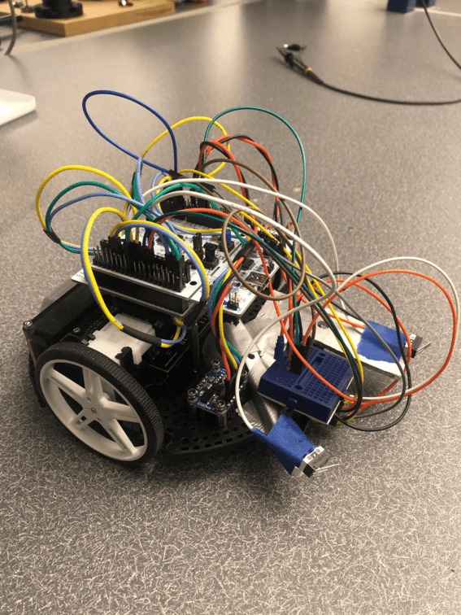
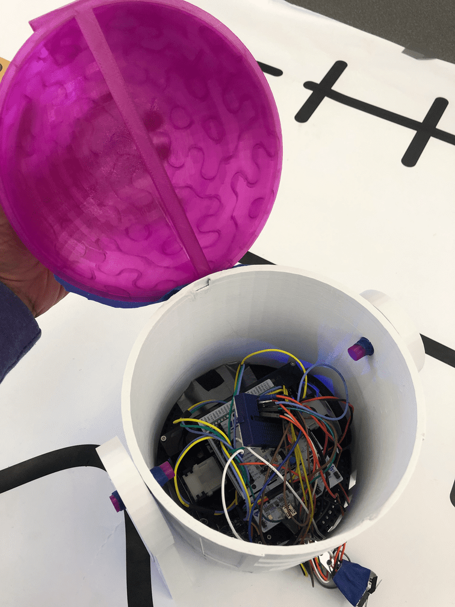
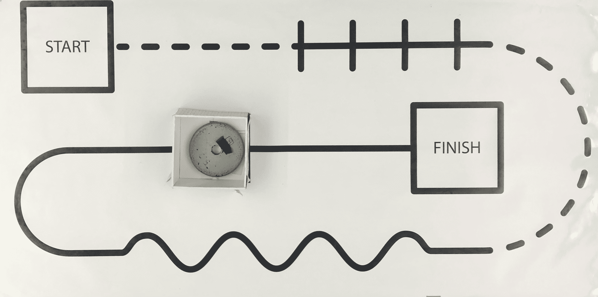

# R4D5 Line-Following Astromech
### Collaborators: Ayush Kakkanat & Akanksha Maddi

Click [here](https://Ayush17318.github.io/line-follower/) for the website version.

This is the summarized documentation for the R4D5 robot and will discuss the process, logic, and tools used. The project was completed in a span of 5 weeks and has the following functions to execute:
- Linear line tracking
- Turn various sized curves
- Not be affected by line breaks
- Not be affected by intersections
- Avoid obstacles
- Stop in an end-zone
- Find its way back to the start-zone
  
The goal of the project was for the robot to navigate any track with the above stated elements arranged in a randomized order with sufficient speed and reliability.

The following links will discuss the hardware, electronics, software, and analysis involved with building the robot pictured below.
- [Hardware & Design](hardware-and-design.md)
- [Electronics](electronics.md)
- [Software](software.md)
- [Analysis](analysis.md)

put in naked romi and r4d5 romi photos

(Talk about how the robot was tested on two tracks as pictured)

Final results

https://github.com/Ayush17318/line-follower/assets/124316330/a02ead4f-ce9b-40d5-a018-f97797cce66d

Challenges

One of the biggest challenges we had in this project was ensuring that the two motors were running at the same or desired speed. When simply setting the duty cycle of the motors to specific desired speeds, the motors output inconsistent speeds that change based on the amount of voltage from the batteries, friction in the board, drift, and general randomness. To diagnose this, we attempted to implement closed-loop control on the motors using encoder readings. This posed a problem as we realized that there were some fundamental issues with our encoder and velocity readings. This may have been caused by our particular Closed Loop code, encoder code, the integration of this closed loop function with the cotask, or the hardware itself. The motors would often pulsate inconsistently or rotate at a different speed than expected.

To mitigate this, we used a lot of testing and calibrating to preset certain ratios of duty cycles that corresponded to a particular velocity or heading. This, combined with timing certain durations of certain states, particularly with the obstacle detection sequence, allowed us to bypass this issue. Additionally, having more configurable states of logic between the sensors that allow for combinations of turning and pivoting helped to create a really robust sensor task that can handle these inconsistencies created by lagging motor control.

Further Suggestions

To revise this strategy, further evaluation of the program and code structure to diagnose the issue with the encoder readings to sufficiently implement Closed Loop control on the encoders and motors. This will allow us to control the speeds such that the ratios between the two wheels will be what we specifically desire. 

Additionally, this code functions for the two courses specified. To generalize this code for moving from finish back to start, we would use the IMU heading data from a BNO055 to know how much x and y to travel to return to the start of the robot's path. This can be integrated with the limit switch to travel around any obstacle in this return path. Using an additional limit switch along the side of the robot to track along the wall can also be integrated to generalize the path around the obstacle. Driving the robot until the side limit switch loses contact with the wall before turning three times can allow the robot to traverse any path with any size of the rectangular obstacle. 

talk about these
(add a closed loop, use bno055 to keep track of the robot's absolute position and be able to find its way back to the start, get more sensors, a more robust obstacle detection algorithm using a time of flight sensor)

checklist:
finish readme
software page - doxygen, fsm, task diagram
analysis page - math
upload code
